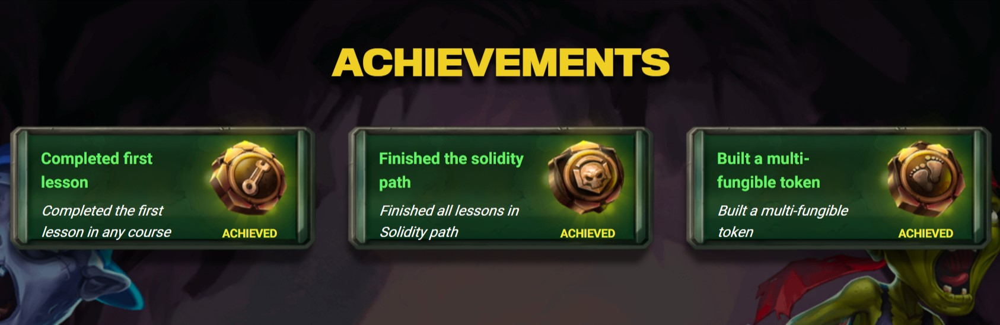
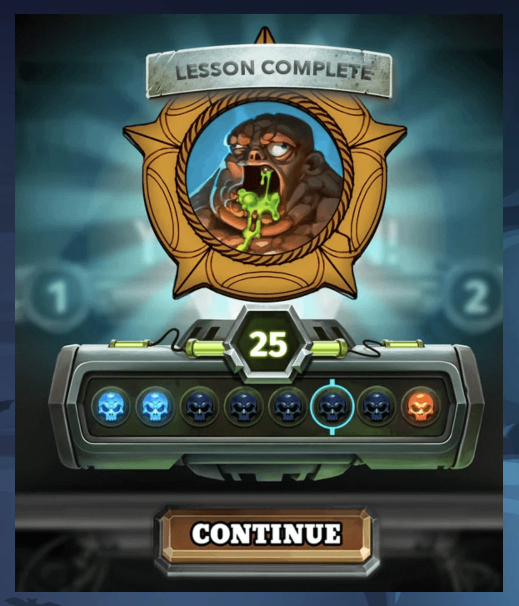

# cryptoZombies

*cryptoZombies* is the most common platform for developers to learn Solidity and about development on Ethereum, the programmable blockchain. It is a course started by *Loom Network*, that talks about variety of concepts of solidity starting from what a contract is and in detail to what tokens are.

Taking an early initiative, access to special lessons was provided (Lessons 7 & 8) for creating custom game elements to their CCG/TCG game called Relentless (earlier called Zombie Battleground)

More courses were added for how to test with truffle and how to build oracles. Furthermore development with zkSync and advanced concepts for zkSync.

## The Curriculum

### Solidity Path: beginner to Intermediate Contracts

- Lesson 1: Making the Zombie Factory
- Lesson 2: Zombies Attack Their Victim
- Lesson 3: Advanced Solidity Concepts
- Lesson 4: Zombie Battle System
- Lesson 5: ERC721 & Crypto-Collectables
- Lesson 6: App Front-Ends & Web3.js

#### Hands-on Path: Make and Deploy a Custom Game Mode

- Lesson 7: Custom Game Modes: Zombie Battleground (now called Relentless)
- Lesson 8: Custom Deck Rules

#### Plasme Path: Learn how to use PlasmaCash

- Lesson 9: ERC721x: Multi Fungible Tokens

### Advanced Solidity Path: Get In-depth Knowledge

- Lesson 10: Deploying DApps with Truffle
- Lesson 11: Testing Smart Contracts with Truffle
- Lesson 14: How to Build an Oracle
- Lesson 15: How to Build an Oracle - Part 2
- Lesson 16: How to Build an Oracle - Part 3

### Libra Path: Master the Basics of Libra Blockchain Development

- Lesson 12: Libra Basics [Deprecated]

### Beyong Ethereum Path: Explore the Blockchain Ecosystem

- Lesson 13: All about Binance Chain [Deprecated]
- Lesson 17: Intro to zkSync
- Lesson 18: Advanced zkSync Concepts

### Chainlink Path: Decentralized Oracles

- Lesson 19: Data Feeds and Computation

## Achievements

- Completed `Solidity Path: Beginner to Intermediate Smart Contracts`

- Completed `Multi Fungible Tokens`

&copy; [Loom Network](https://loomx.io/)
